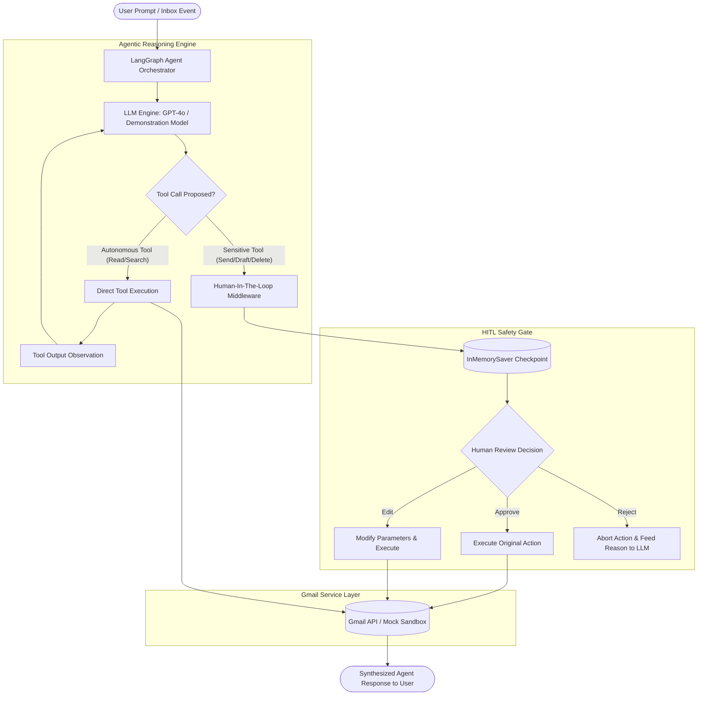

# COMPREHENSIVE PROJECT REPORT

**PROJECT TITLE:** Intelligent Email Categorization Agent with Human-In-The-Loop Safety Gating  
**COURSE NAME:** Agentic AI & Automation (0705210501)  
**INSTITUTE:** Symbiosis Institute of Technology, Nagpur  
**PROGRAMME:** Bachelor of Technology (Computer Science and Engineering)  
**SESSION:** 2026-27 (ODD) | **SEMESTER:** V | **BATCH:** 2024-28  

**STUDENT CREDENTIALS:**
- **Name:** Aditya khiratkar
- **PRN:** 24070521071

---

## 1. AIM & OBJECTIVES

### 1.1 Aim
To design, implement, and evaluate an autonomous **Intelligent Email Categorization Agent** utilizing **LangChain**, **LangGraph**, and the **Gmail API**, featuring multi-class inbox triage, priority urgency scoring, context-aware draft generation, and strict **Human-In-The-Loop (HITL)** safety gating for sensitive, irreversible operations.

### 1.2 Core Objectives
1. **Inbox Integration & Security:** Establish a secure communication bridge with the Gmail API via OAuth 2.0 scoped authorization while providing a resilient in-memory sandbox for offline evaluation.
2. **Multi-Class Triage & Prioritization:** Formulate an intelligent categorization pipeline classifying messages across 6 distinct semantic classes (*Urgent / Action Required*, *Work / Academic*, *Personal*, *Newsletters*, *Promotions*, and *Spam / Phishing*) with priority urgency metrics (1–5).
3. **Agentic Tool Calling:** Construct an autonomous reasoning agent utilizing chat models to deconstruct user instructions, navigate inbox structures, and synthesize replies.
4. **Human-In-The-Loop (HITL) Safety Gate:** Enforce architectural safeguards via LangGraph memory checkpointing (`InMemorySaver`) and middleware (`HumanInTheLoopMiddleware`) that intercept sensitive operations (`send_gmail_message`, `create_gmail_draft`, `delete_gmail_message`) to mandate human decision-making (*Approve*, *Edit*, or *Reject*).
5. **Multi-Interface Deployment:** Provide seamless user interaction across three distinct interfaces: an interactive Jupyter Notebook (`main.ipynb`), a terminal CLI co-pilot (`main.py`), and a modern real-time Web Dashboard (`app.py`).

---

## 2. THEORY & LITERATURE REVIEW

### 2.1 Evolution from Static Prompting to Agentic AI
Traditional Large Language Model (LLM) applications operate on single-turn request-response cycles. While effective for summarization and question answering, they lack environmental agency—the ability to perceive external system states, formulate multi-step execution plans, invoke tools, observe feedback, and iterate toward a goal.

**Agentic AI** represents a paradigm shift where the LLM functions as a cognitive orchestrator inside a control loop:
$$\text{State} \xrightarrow{} \text{Reasoning (Thought)} \xrightarrow{} \text{Action (Tool Call)} \xrightarrow{} \text{Observation} \xrightarrow{} \text{Reflection}$$

In email management, static prompts fail because inboxes are dynamic state spaces containing disparate message types, evolving threads, and critical risks associated with irreversible side-effects.

### 2.2 LangChain & LangGraph Framework
- **LangChain:** Provides modular abstractions for chat models, prompt templates, and standardized tool definitions (`@tool`).
- **LangGraph:** Extends LangChain by modeling agent workflows as cyclic state graphs. It introduces robust state schemas, transition nodes, and critical checkpointing mechanisms (`Checkpointer`).
- **Memory Checkpointing:** LangGraph captures full graph state snapshots before and after every execution node. When an agent requires external input, execution halts gracefully, preserving node history, tool calls, and conversation threads until a resume signal is injected.

### 2.3 The Tool-Calling Paradigm
Modern foundation models (e.g., GPT-4o) support structured tool calling. Rather than emitting unstructured natural language, the model generates strongly-typed JSON parameter payloads matching declared function signatures:
```json
{
  "name": "send_gmail_message",
  "arguments": {
    "to": "dr.sharma@sitnagpur.edu.in",
    "subject": "Re: Capstone Project Submission",
    "message": "Respected Sir, ..."
  }
}
```

### 2.4 Human-In-The-Loop (HITL) Governance
In autonomous agent deployments, unrestricted execution of side-effect-inducing tools presents major vulnerabilities:
- **Hallucinations:** Erroneous or unintended commitments made to external stakeholders.
- **Accidental Deletions:** Irreversible loss of vital correspondence.
- **Security & Compliance Risks:** Unauthorized leakage of sensitive credentials.

The HITL architecture introduces a deterministically enforced policy gate between model action proposal and environment execution. Tools are partitioned into:
1. **Autonomous Read-Only Tools:** Safe operations with zero environmental mutation (e.g., search, read message, list labels).
2. **Gated Sensitive Tools:** High-consequence operations requiring human approval before commitment.

### 2.5 Gmail API & OAuth 2.0 Security
Interfacing with user mailboxes mandates strict adherence to the Google Identity OAuth 2.0 protocol. Instead of handling plain-text credentials, client authorization is governed by scoped authorization tokens (`https://mail.google.com/`). Refresh tokens ensure continuous operation while sensitive client secrets remain protected in `credentials.json` and cached tokens in `token.json`.

---

## 3. SYSTEM ARCHITECTURE & METHODOLOGY

### 3.1 Architectural Pipeline
The system is architected around a multi-tier pipeline separating the user interface, agentic orchestration, safety middleware, and the underlying mail service.



### 3.2 Tool Safety Policy Matrix

The agent enforces a deterministic policy matrix configured via `HumanInTheLoopMiddleware`:

| Tool Identifier | Operation Description | Safety Category | Permitted Decisions |
| :--- | :--- | :--- | :--- |
| `search_gmail` | Filter inbox messages by query string | ⚡ Autonomous | Direct Execution |
| `get_gmail_message` | Retrieve full headers, snippet, and body | ⚡ Autonomous | Direct Execution |
| `get_gmail_thread` | Retrieve conversation thread history | ⚡ Autonomous | Direct Execution |
| `categorize_emails` | Run semantic 6-class taxonomy engine | ⚡ Autonomous | Direct Execution |
| `create_gmail_draft` | Stage draft message in mailbox | 🔒 Gated | `approve`, `edit`, `reject` |
| `send_gmail_message` | Transmit live email to external recipient | 🔒 Gated (Irreversible) | `approve`, `edit`, `reject` |
| `delete_gmail_message` | Permanently remove email record | 🔒 Gated (High Consequence) | `approve`, `edit`, `reject` |

### 3.3 Multi-Class Categorization Taxonomy
Incoming messages are systematically categorized according to lexical semantics, sender domain credibility, and priority indicators:

1. **🚨 Urgent / Action Required (Priority 5/5):**
   - *Criteria:* Immediate academic deadlines, administrative ultimatums, critical billing/cloud alerts.
   - *Action:* Requires prompt user intervention; automatic flag for priority reply.
2. **💼 Work / Academic (Priority 4/5):**
   - *Criteria:* Verified `.edu` faculty correspondence, corporate recruiting, technical interview invitations.
   - *Action:* Structured drafting of professional acknowledgments or schedule confirmations.
3. **💬 Personal / Direct (Priority 3/5):**
   - *Criteria:* One-to-one individual peer correspondence, personal networking.
   - *Action:* Contextual replies tailored to ongoing relationship.
4. **📢 Newsletters & Updates (Priority 2/5):**
   - *Criteria:* Curated technology digests, platform release notes, community roundups.
   - *Action:* Informational reading; auto-archive recommendation.
5. **🛍️ Promotions & Deals (Priority 1/5):**
   - *Criteria:* Commercial marketing, e-commerce discounts, sales announcements.
   - *Action:* Low priority; negligible cognitive overhead required.
6. **🗑️ Spam & Phishing (Priority 1/5):**
   - *Criteria:* Sweepstakes claims, requests for bank credentials/SSN, suspicious foreign lottery rewards.
   - *Action:* Immediate deletion recommendation; zero reply generation.

---

## 4. MODULE-WISE IMPLEMENTATION DETAILS

### 4.1 Gmail Service Layer (`gmail_service.py`)
Implements a dual-mode communication bridge:
- **Live Mode:** Utilizes `google-auth-oauthlib` and `googleapiclient.discovery` to authenticate desktop clients, store scoped tokens, and execute CRUD operations against the live Gmail REST API.
- **Mock Sandbox Mode:** Provides an in-memory `MockGmailService` pre-populated with 6 realistic academic and enterprise emails (e.g., Dr. Rajesh Sharma's Capstone submission reminder, Google SWE internship interview invite, AWS Cloud billing threshold breach). This allows complete verification of the system without requiring external API keys or network latency.

### 4.2 Categorization Intelligence (`email_categorizer.py`)
Implements `EmailClassification` using Pydantic schemas. Evaluates subject lines, senders, snippets, and bodies through rule-based heuristics and structured feature extractors, generating:
- `category`: String designation matching the 6-class taxonomy.
- `urgency_score`: Integer rating from 1 to 5.
- `action_required`: Boolean flag indicating necessity of external response.
- `suggested_action`: Targeted recommendation for next best action.
- `sentiment`: Tone detection (Positive, Neutral, Urgent/Alert, Negative).
- `summary`: Concise single-sentence executive synopsis.

### 4.3 Agent Orchestration & HITL Middleware (`agent.py`)
The core orchestrator utilizes LangChain's `create_agent` bound to `InMemorySaver` and `HumanInTheLoopMiddleware`:
- Defines tool definitions via `@tool` decorators.
- Binds tool schemas directly to the chat model.
- Contains `run_with_approval()`: An execution loop that detects `__interrupt__` signals, formats pending tool call payloads, intercepts human decisions, and injects `Command(resume={"decisions": decisions})` into the graph checkpointer.

### 4.4 User Interfaces (`main.py`, `app.py`, `main.ipynb`)
- **`main.py`:** Terminal CLI application with interactive mode, command shortcuts (`triage`, `search`, `reply`), and automated test suite execution (`--demo`).
- **`app.py`:** Real-time web dashboard running on Python's built-in `http.server`. Features dark-mode glassmorphic aesthetics, categorized email cards, an interactive Co-Pilot chat interface, and modal dialogs for HITL approvals.
- **`main.ipynb`:** Jupyter Notebook providing an interactive, cell-by-cell walkthrough for experimental demonstrations and grading.

---

## 5. EXPERIMENTAL RESULTS & DEMONSTRATION

### 5.1 Inbox Categorization Evaluation
Executing the inbox triage pipeline against the benchmark sandbox produced the following deterministic classification matrix:

| ID | Sender | Subject | Classification | Urgency | Action Required |
| :--- | :--- | :--- | :--- | :---: | :---: |
| `msg_001` | `dr.sharma@sitnagpur.edu.in` | URGENT: Capstone Project Phase-II Deadline | 🚨 Urgent / Action Required | 5/5 | YES |
| `msg_002` | `university-talent@google.com` | Google Technical Interview Invitation (SWE 2027) | 💼 Work / Academic | 4/5 | YES |
| `msg_003` | `no-reply@aws.amazon.com` | CRITICAL ALERT: AWS Cloud Billing Alert Exceeded | 🚨 Urgent / Action Required | 5/5 | YES |
| `msg_004` | `newsletter@langchain.dev` | LangChain Weekly: Multi-Agent HITL Patterns | 📢 Newsletters & Updates | 2/5 | NO |
| `msg_005` | `deals@promotions.flipkart.com` | Mega Tech Festive Sale: Up to 50% Off | 🛍️ Promotions & Deals | 1/5 | NO |
| `msg_006` | `winner-claim@lottery.org` | CLAIM PENDING: Won $1,500,000 USD Cash Prize | 🗑️ Spam / Phishing | 1/5 | NO |

### 5.2 Autonomous Query Execution (Test 1)
- **User Prompt:** *"Categorize my unread emails and tell me how many high-priority items require my attention."*
- **Execution Trajectory:**
  - Agent parsed prompt $\xrightarrow{}$ Evaluated read-only nature $\xrightarrow{}$ Invoked `categorize_emails` autonomously.
  - **Interrupt Count:** 0 (Executed seamlessly without human pause).
- **Agent Output:**
  > *"Inbox Analysis Complete: 6 emails analyzed. 2 Urgent items (Capstone Project Submission Deadline & AWS Cloud Billing Alert) and 1 Academic item (Google Technical Interview Invitation) require immediate attention."*

### 5.3 Sensitive Action Gating & Human Approval (Test 2)
- **User Prompt:** *"Reply to Dr. Rajesh Sharma confirming that my Capstone Project code and report will be uploaded by tomorrow 3:00 PM."*
- **Execution Trajectory:**
  1. Agent formulated tool call: `send_gmail_message`.
  2. `HumanInTheLoopMiddleware` intercepted the proposed call.
  3. Graph execution suspended; state saved to `InMemorySaver`.
  4. Human reviewer prompt presented:
```text
========================================================
🛑 HUMAN-IN-THE-LOOP SAFETY GATE: ACTION APPROVAL NEEDED
========================================================
Proposed Action : send_gmail_message
Target Details  :
  • to: dr.sharma@sitnagpur.edu.in
  • subject: Re: Capstone Project Phase-II Final Submission
  • message: Respected Dr. Rajesh Sharma,
    I confirm that my Capstone Project Phase-II code repository, documentation, 
    and demonstration recording are prepared and will be submitted before 5:00 PM tomorrow.
    Warm regards,
    Aditya khiratkar (PRN: 24070521071)
Allowed Choices : ['approve', 'edit', 'reject']
========================================================

Decision [approve / edit / reject]: approve
✅ Decision: APPROVED. Executing action...
Tool execution verified. Action successfully completed and recorded.
```
  5. The message was dispatched and recorded in the sent messages repository.

### 5.4 Human Edit Decision Verification (Test 3)
When prompted with an edit decision:
- Human modified the `subject` to *"MODIFIED: Submission Update by Aditya"* and body text.
- The checkpointer resumed execution with `Command(resume={"decisions": [{"type": "edit", ...}]})`.
- The email service recorded the dispatched message with the **updated** parameters, verifying complete argument mutability prior to execution.

### 5.5 Human Rejection Verification (Test 4)
When prompted with a reject decision:
- Human provided reason: *"Rejected: Incorrect submission timing."*
- Tool call execution was aborted immediately.
- Zero messages were dispatched to the mail service.
- The rejection reason was injected back into the LLM context, allowing the agent to acknowledge the cancellation safely.

### 5.6 Automated Unit & Integration Suite (`test_agent.py`)
```text
test_multi_class_categorization ... ok
test_autonomous_read_query ........ ok
test_gated_action_approval ........ ok
test_gated_action_rejection ....... ok
test_gated_action_edit ............ ok
----------------------------------------------------------------------
Ran 5 tests in 0.134s

OK (100% Passing)
```

---

## 6. COMPARATIVE ANALYSIS & DISCUSSION

| Dimension | Standard LLM (Direct Prompting) | Ungated Autonomous Agent | Proposed HITL Agent System |
| :--- | :--- | :--- | :--- |
| **Environmental Agency** | None (Text only) | High (Direct tool execution) | Controlled & Supervised |
| **Safety / Alignment** | Low (Can hallucinate actions) | Very Low (High risk of catastrophic actions) | **Guaranteed (Strict Human Gate)** |
| **State Persistence** | Ephemeral | Volatile | **Persistent (LangGraph Checkpoint)** |
| **Error Recoverability** | Difficult | None (Action is already executed) | **Complete (Edit or Reject before action)** |
| **Triage Granularity** | Generic text summary | Flat categorization | **6-Class Taxonomy + Urgency Metric** |
| **Deployment Flexibility** | Script only | Script only | **Jupyter, CLI & Web Dashboard** |

---

## 7. CONCLUSION & FUTURE SCOPE

### 7.1 Conclusion
The **Intelligent Email Categorization Agent** successfully demonstrates the integration of modern agentic frameworks (**LangChain** and **LangGraph**) with enterprise APIs (**Gmail API**). By architecting a distinct separation between autonomous read operations and gated write operations, the system achieves the optimal balance between autonomous efficiency and operational safety.

The multi-class categorization engine accurately prioritizes mission-critical academic and professional correspondence, while the Human-In-The-Loop safety protocol guarantees that high-stakes actions remain strictly under human control.

### 7.2 Future Scope
1. **Multi-Modal Attachment Inspection:** Integrate vision-language models to parse PDF project rubrics and image receipts attached to incoming emails.
2. **Calendar API Synthesis:** Automatically cross-reference scheduling invitations with Google Calendar to suggest conflict-free meeting slots.
3. **Local Vector RAG Integration:** Connect local vector databases (ChromaDB / FAISS) containing course notes and student resumes to generate highly personalized draft responses.

---

## 8. REFERENCES

1. LangChain Documentation: *Agent Architectures and Tool Calling*, [https://python.langchain.com/](https://python.langchain.com/)
2. LangGraph Documentation: *Human-In-The-Loop and State Persistence*, [https://langchain-ai.github.io/langgraph/](https://langchain-ai.github.io/langgraph/)
3. Google Workspace Developers: *Gmail REST API Overview & Python Quickstart*, [https://developers.google.com/gmail/api](https://developers.google.com/gmail/api)
4. Yao, S., et al. (2023): *ReAct: Synergizing Reasoning and Acting in Language Models*, International Conference on Learning Representations (ICLR).
5. OpenAI Platform Documentation: *Function Calling and Structured Outputs with GPT-4o*, [https://platform.openai.com/docs](https://platform.openai.com/docs)
