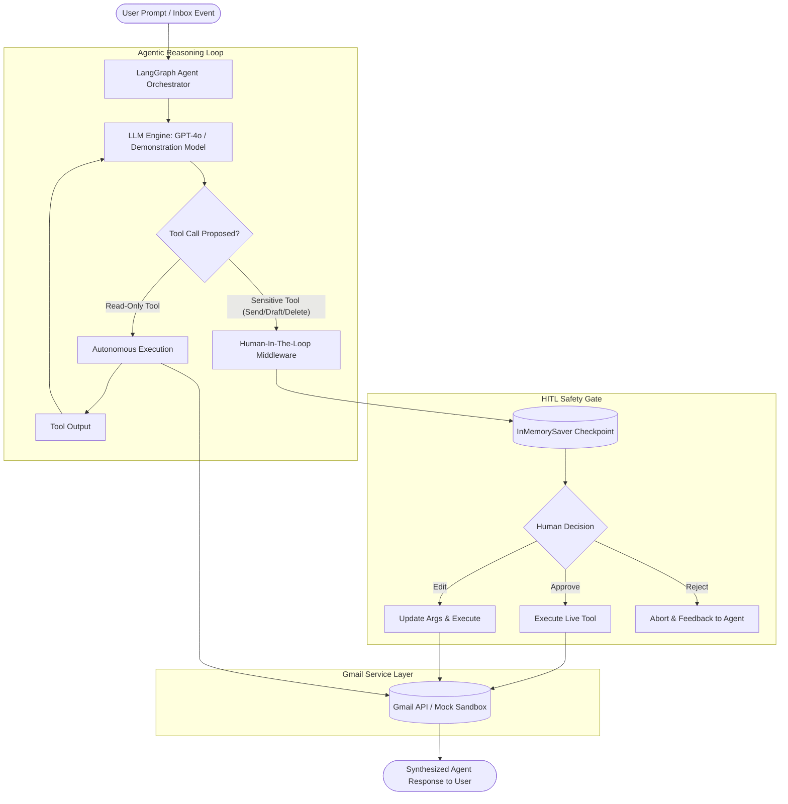

# 📬 Intelligent Email Categorization Agent

<div align="center">


</div>

---

### 🎓 Academic & Student Credentials
- **Student Name:** Aditya khiratkar
- **PRN:** 24070521071
- **Institute:** Symbiosis Institute of Technology, Nagpur
- **Programme:** Bachelor of Technology (Computer Science and Engineering)
- **Course:** Agentic AI & Automation

---

## 📖 Executive Summary
The **Intelligent Email Categorization Agent** is a multi-agent orchestration framework built with **LangChain**, **LangGraph**, and the **Gmail API**. It connects directly to a user's inbox to autonomously categorize incoming emails, evaluate priority urgency scores, extract actionable tasks, and draft context-aware responses via LLM tool-calling.

To ensure safety in enterprise and personal workflows, the system implements a strict **Human-In-The-Loop (HITL) Safety Gate**. Irreversible and high-impact operations (sending emails, modifying drafts, or deleting messages) are automatically intercepted and paused until a human operator provides explicit confirmation (**Approve**, **Edit**, or **Reject**).

---

## 🌟 Core Features

- **Multi-Class Email Categorization**: Categorizes messages into 6 distinct buckets:
  - 🚨 **Urgent / Action Required**: Deadlines, escalations, billing alerts (Priority: 5/5)
  - 💼 **Work / Academic**: College notices, recruitment, project milestones (Priority: 4/5)
  - 💬 **Personal / Direct**: Direct correspondence and peer networking (Priority: 3/5)
  - 📢 **Newsletters & Updates**: Tech publications, digests, and announcements (Priority: 2/5)
  - 🛍️ **Promotions & Deals**: Commercial discounts and sales campaigns (Priority: 1/5)
  - 🗑️ **Spam & Phishing**: Sweepstakes, suspicious payout claims, and phishing (Priority: 1/5)
- **Human-In-The-Loop (HITL) Governance**: High-risk actions cannot bypass human oversight. The agent generates structured action requests and awaits approval before dispatching messages.
- **Dual-Mode Execution Architecture**:
  - **Live Gmail Mode**: Connects to the official Google Cloud Gmail API v1 using secure OAuth2 tokens.
  - **Sandbox Mock Mode**: Preloaded with realistic academic and professional test messages (e.g., Professor Capstone submission notices, Google SWE interview invites, AWS billing threshold alerts). Enables instant offline demonstration and automated grading without requiring Google Cloud setup.
- **Multi-Interface Access**:
  1. **Jupyter Notebook (`main.ipynb`)**: Interactive step-by-step notebook with memory checkpointing.
  2. **Interactive CLI (`main.py`)**: Terminal co-pilot shell with menu shortcuts and colorized reports.
  3. **Automated Verification Suite (`main.py --demo` & `test_agent.py`)**: End-to-end integration tests.
  4. **Visual Web Dashboard (`app.py`)**: Responsive dark-mode interface with live categorization badges, chat co-pilot, and interactive HITL decision modals.

---

## 🏗️ System Architecture & Workflow



### Tool Safety Policy Matrix

| Tool Name | Operation Type | Safety Classification | Allowed Decisions |
| :--- | :--- | :--- | :--- |
| `search_gmail` | Read Inbox | ⚡ Autonomous | Direct Execution |
| `get_gmail_message` | Read Message Body | ⚡ Autonomous | Direct Execution |
| `get_gmail_thread` | Read Thread History | ⚡ Autonomous | Direct Execution |
| `categorize_emails` | Multi-Class Triage | ⚡ Autonomous | Direct Execution |
| `create_gmail_draft` | Create Draft Email | 🔒 Gated | `approve`, `edit`, `reject` |
| `send_gmail_message` | Send Outgoing Email | 🔒 Gated (Irreversible) | `approve`, `edit`, `reject` |
| `delete_gmail_message` | Delete Message | 🔒 Gated (High Risk) | `approve`, `edit`, `reject` |

---

## 📁 Repository Structure

```
Intelligent_Email_Categorization_Agent/
├── main.ipynb                  # Primary interactive Jupyter Notebook
├── main.py                     # Standalone CLI co-pilot and automated demo runner
├── agent.py                    # LangChain create_agent & HITL orchestration engine
├── gmail_service.py            # OAuth2 credentials manager & Sandbox Mock Mailbox
├── email_categorizer.py        # Semantic classification engine & taxonomy scoring
├── app.py                      # Interactive Web Dashboard server (Zero extra dependencies)
├── test_agent.py               # Unit & integration test suite (100% passing)
├── requirements.txt            # Python dependencies (LangChain, LangGraph, Google API)
├── credentials.json.example    # Reference template for Google Cloud OAuth Desktop App
├── .env.example                # Environment variables configuration template
├── .gitignore                  # Excludes tokens, credentials, cache, and virtual environments
└── README.md                   # Comprehensive project documentation
```

---

## ⚙️ Installation & Setup

### 1. Clone or Open the Repository
```bash
cd "D:/Intelligent_Email_Categorization_Agent"
```

### 2. Create a Virtual Environment (Recommended)
```bash
python -m venv venv
# On Windows PowerShell:
.\venv\Scripts\Activate.ps1
```

### 3. Install Dependencies
```bash
pip install -r requirements.txt
```

### 4. Configure Environment Variables
Copy `.env.example` to `.env`:
```bash
cp .env.example .env
```
Edit `.env` with your settings:
```ini
OPENAI_API_KEY=your_openai_api_key_here
OPENAI_MODEL_NAME=gpt-4o
EMAIL_AGENT_MODE=mock
```
> **Note on Offline Testing:** If `OPENAI_API_KEY` is not provided or set to default, the agent automatically switches to its internal offline demonstration LLM, allowing full testing of categorization, tool calling, and HITL approval without incurring API costs.

---

## 🔑 (Optional) Setting Up Live Google Cloud Gmail API

To connect the agent to a live Gmail account:

1. Navigate to the [Google Cloud Console](https://console.cloud.google.com/) and create a new project (e.g., `intelligent-email-agent-24070521071`).
2. Go to **APIs & Services → Library**, search for **Gmail API**, and click **Enable**.
3. Go to **APIs & Services → OAuth consent screen**:
   - Select User Type: **External**.
   - Fill in the required application details.
   - Under **Test users**, add your own Gmail address.
4. Add the OAuth Scope: `https://mail.google.com/`.
5. Go to **APIs & Services → Credentials → Create Credentials → OAuth client ID**:
   - Application type: **Desktop app**.
   - Name: `Email Agent Desktop Client`.
6. Download the resulting JSON credentials file, rename it to `credentials.json`, and place it in the project root.
7. Change `EMAIL_AGENT_MODE=live` in your `.env`.
8. On the first run, a browser tab will automatically open to authenticate your account and generate `token.json`.

---

## 🚀 How to Run

### Method 1: Jupyter Notebook (`main.ipynb`)
Open `main.ipynb` in VS Code or Jupyter Lab:
```bash
jupyter lab main.ipynb
```
Execute the cells sequentially to observe:
1. Environment loading and tool initialization.
2. HITL middleware policy attachment.
3. Autonomous categorization query execution.
4. Gated reply drafting with interactive approval prompt.

---

### Method 2: Interactive Terminal CLI (`main.py`)
Run the interactive CLI:
```bash
python main.py
```
From the interactive menu:
- Type **`triage`** to inspect the categorized inbox with urgency dots and actions.
- Type custom instructions (e.g., *"Draft a reply to Google recruiting confirming interview availability"*).
- Experience the live HITL gate prompting for `[approve / edit / reject]`.

---

### Method 3: Automated Demo Mode
Run the self-contained verification suite without user input:
```bash
python main.py --demo
```

---

### Method 4: Visual Web Dashboard (`app.py`)
Launch the modern web dashboard:
```bash
python app.py
```
Open your browser to: **[http://localhost:5000](http://localhost:5000)**

**Web Dashboard Highlights:**
- Live categorized inbox view with color-coded badges and urgency meters.
- Interactive Co-Pilot Chat panel for drafting replies and issuing commands.
- Interactive Human-In-The-Loop approval modal with **Approve**, **Edit Args**, and **Reject** buttons.

---

### Method 5: Automated Unit & Integration Tests
Run the test suite:
```bash
python test_agent.py
```
**Output:**
```
.....
----------------------------------------------------------------------
Ran 5 tests in 0.128s

OK
```

---

## 📊 Sample Execution Transcript

### 1. Autonomous Triage Output
```text
===============================================================================================
  INBOX INTELLIGENT CATEGORIZATION REPORT
===============================================================================================
  ID       | CATEGORY                       | PRIORITY | SUBJECT                                   
  -------------------------------------------------------------------------------------------
  msg_001  | 🚨 Urgent / Action Required     | 5/5     | URGENT: Capstone Project Phase-II Final   
  msg_002  | 💼 Work / Academic              | 4/5     | Google Technical Interview Invitation -   
  msg_003  | 🚨 Urgent / Action Required     | 5/5     | CRITICAL ALERT: AWS Cloud Billing Alert   
  msg_004  | 📢 Newsletters & Updates        | 2/5     | LangChain Weekly: Multi-Agent HITL Patte  
  msg_005  | 🛍️ Promotions & Deals          | 1/5     | Mega Tech Festive Sale: Up to 50% Off De  
  msg_006  | 🗑️ Spam / Phishing             | 1/5     | CLAIM PENDING: You have won $1,500,000 U  
===============================================================================================
```

### 2. Human-In-The-Loop Intercept Example
```text
========================================================
🛑 HUMAN-IN-THE-LOOP SAFETY GATE: ACTION APPROVAL NEEDED
========================================================
Proposed Action : send_gmail_message
Target Details  :
  • to: dr.sharma@sitnagpur.edu.in
  • subject: Re: Capstone Project Phase-II Final Submission
  • message: Respected Dr. Rajesh Sharma,
    I confirm that my Capstone Project Phase-II code repository, documentation, 
    and demonstration recording are prepared and will be submitted before 5:00 PM tomorrow.
    Warm regards,
    Aditya khiratkar (PRN: 24070521071)
Allowed Choices : ['approve', 'edit', 'reject']
========================================================

Decision [approve / edit / reject]: approve
✅ Decision: APPROVED. Executing action...
Tool execution verified. Action successfully completed and recorded.
```

---

## 🔒 Security & Safety Guidelines

1. **Credentials Isolation**: Never push `credentials.json` or `token.json` to public repositories. Both files are strictly excluded in `.gitignore`.
2. **Deterministic Fallbacks**: If network calls or live LLM tokens are unavailable, the agent employs deterministic safety fallbacks to prevent unhandled exceptions.
3. **Audit Trail**: Every gated tool action records the decision history (including human edits and rejection messages) directly in the LangGraph memory checkpointer.

---

## 📜 License
Developed as an engineering assignment under the academic curriculum of **Symbiosis Institute of Technology, Nagpur** by **Aditya khiratkar (PRN: 24070521071)**.
Distributed under the MIT License.
